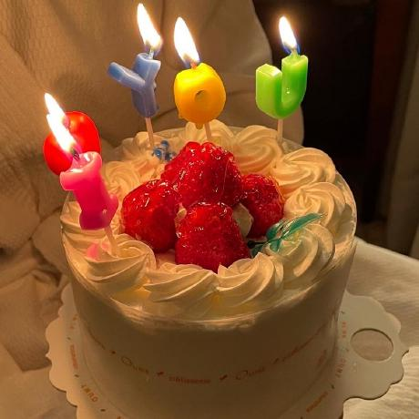

# 코딩테스트

## 규칙

- 각자 문제 풀고 자기 이름의 폴더에 풀이 올리기
- 과제 commit시 commit msg로 꼭 작성날짜 입력해주기

  - ex) '2023-12-26 숫자 변환하기'

- 문제출제순서(2일단위 카톡 알림)
  - 제출 순서: `yht0827 -> Evelyn -> Jimin -> Eunleelee -> HongSP99 -> LEE SUBEEN`
  
- 문제 출제 / 제출 기한
  - 문제 제출(README.md에 낼것)
  - 프로그래머스 Lv 1~2
  - 제출기한 : 자정
- 벌금
  - 한 문제라도 미제출 시 벌금 2000원
  - 못 푸는 것이 아닌 안 푸는 것에 대한 벌금입니다.
  - 토스 모임통장으로 투명하게 운영하겠습니다.
  - Pass권 한 달에 2번 사용 가능합니다.
  - 벌금은 매달 말일에 정확하게 N분의 1로 보내드리겠습니다.
  - 말일 전, 중도 하차는 보내드릴 수 없습니다.

### 패스권 사용
- 아이디(날짜)

## 문제

프로그래머스 문제

  
## 12.28
- [숫자 변환하기](https://school.programmers.co.kr/learn/courses/30/lessons/154538)      
- [이모티콘 할인행사](https://school.programmers.co.kr/learn/courses/30/lessons/150368)      

## 12.29
- [석유 시추](https://school.programmers.co.kr/learn/courses/30/lessons/250136)      
- [공원 산책](https://school.programmers.co.kr/learn/courses/30/lessons/172928)      

## 12.30
- [구멍 보트](https://school.programmers.co.kr/learn/courses/30/lessons/42885)    
- [두 큐 합 같게 만들기](https://school.programmers.co.kr/learn/courses/30/lessons/118667)    

## 12.31
- [호텔 대실](https://school.programmers.co.kr/learn/courses/30/lessons/155651)   
- [성격 유형 검사하기](https://school.programmers.co.kr/learn/courses/30/lessons/118666)   

## 1.1
- [둘만의 암호](https://school.programmers.co.kr/learn/courses/30/lessons/155652)  
- [무인도 여행](https://school.programmers.co.kr/learn/courses/30/lessons/154540)  

## 1.2
- [신규 아이디 추천](https://school.programmers.co.kr/learn/courses/30/lessons/72410)
- [키패드 누르기](https://school.programmers.co.kr/learn/courses/30/lessons/67256)

## 1.3
- [대충 만든 자판](https://school.programmers.co.kr/learn/courses/30/lessons/160586)
- [뒤에 있는 큰 수 찾기](https://school.programmers.co.kr/learn/courses/30/lessons/154539)

## 1.4
- [연속 부분 수열 합의 개수](https://school.programmers.co.kr/learn/courses/30/lessons/131701)
- [개인정보 수집 유효기간](https://school.programmers.co.kr/learn/courses/30/lessons/150370)

